# Project Handover — Spree Commerce

**Handover date:** 30 July 2026
**Status:** live on production, ready for demo / UAT.

This document is written for a recipient **who already knows Spree**. It covers where
to sign in, what is in place, what is not, and what to do next. It is self-contained —
nothing else is needed to pick the system up.

---

## 1. Start here

| # | Step | Link |
|---|---|---|
| 1 | Sign in to the admin | **https://spree.b-teka.com/admin** |
| 2 | Open the customer storefront | **https://shop.b-teka.com** |
| 3 | Review how B2B is configured | §2.3 below |

Primary admin account:

```
https://spree.b-teka.com/admin
admin@b-teka.com  /  sent separately
```

> **Passwords are not written in this document.** They are sent over a private channel,
> because this file lives in a source repository and anything written here is readable
> by anyone who can read the repository.
>
> **Change every password once you have signed in.**


---

## 2. The running system

Every screenshot below is taken from the **live production system**, not a staging or
local environment.

### 2.1 Customer storefront — https://shop.b-teka.com

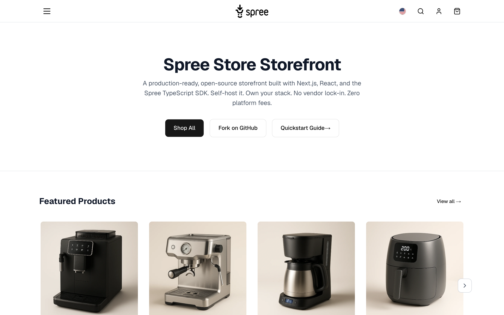

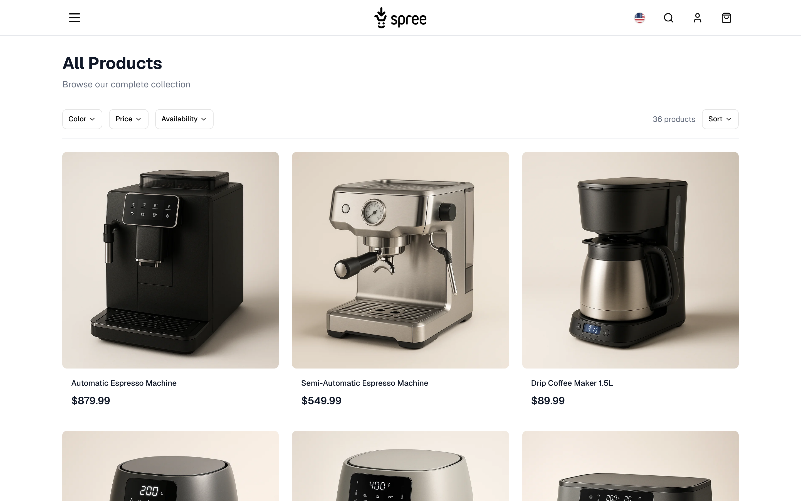

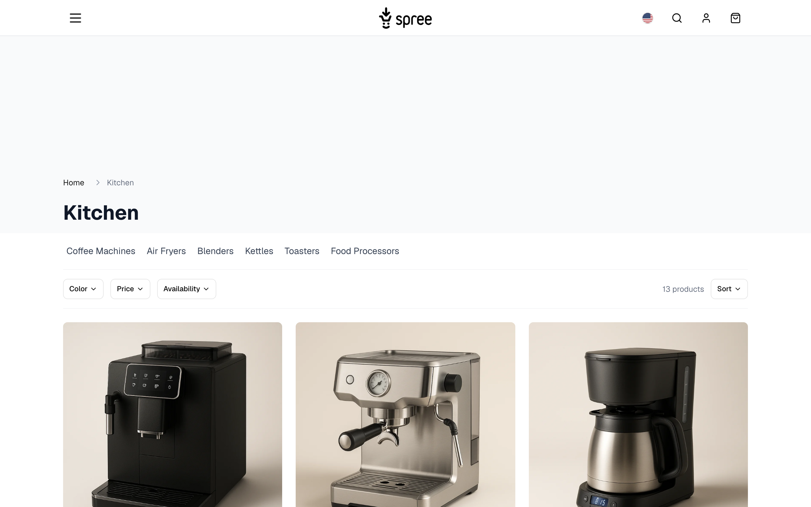

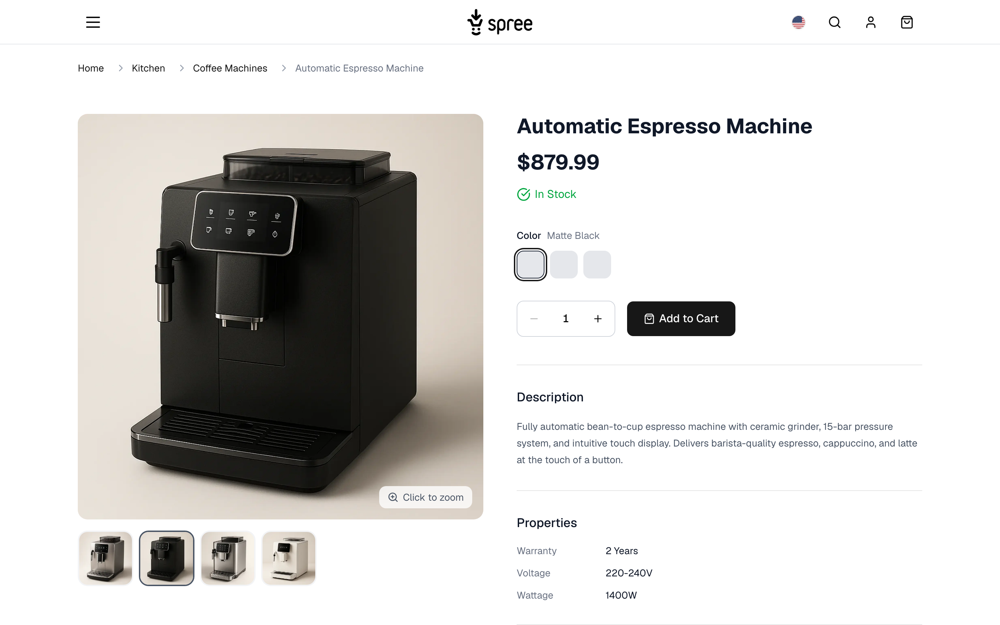

### 2.2 Admin — https://spree.b-teka.com/admin

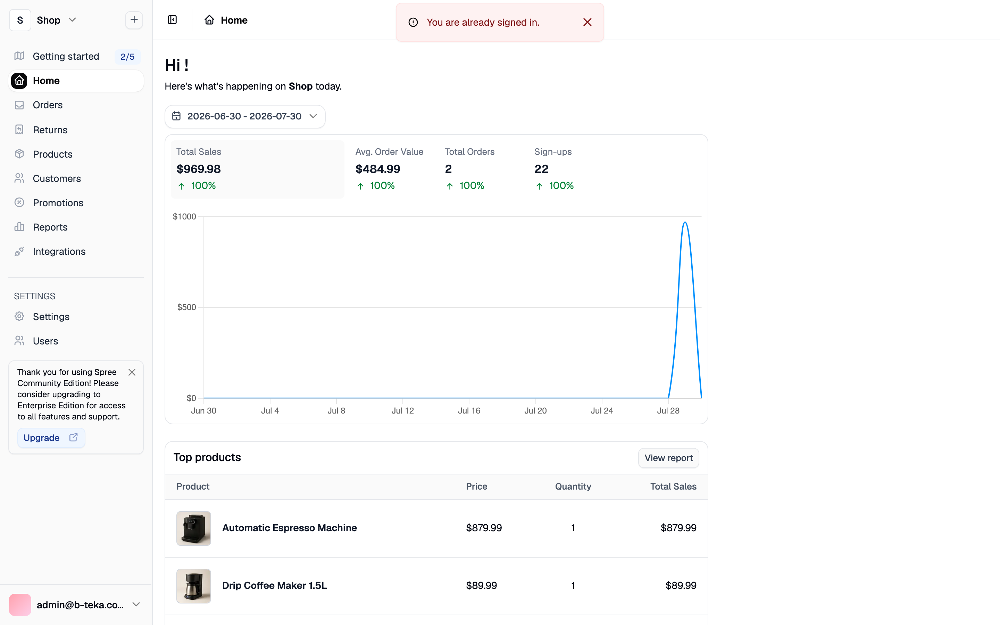

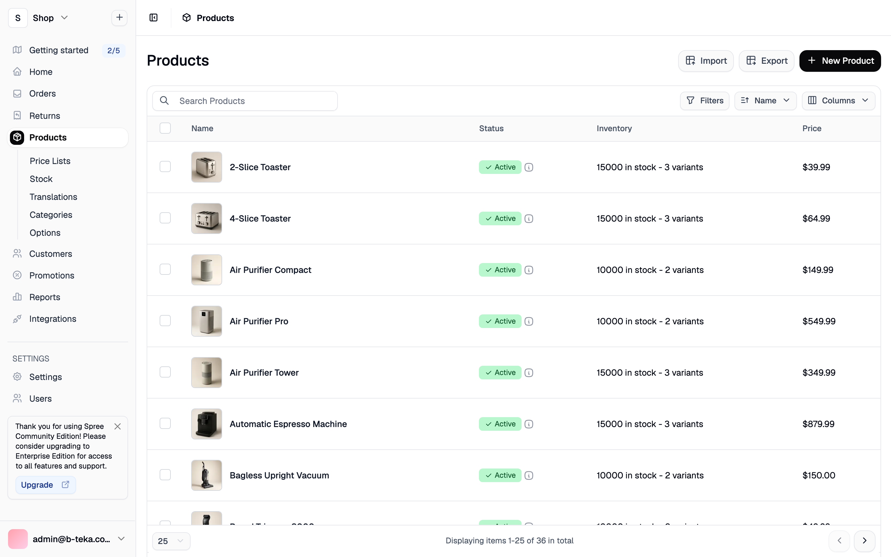

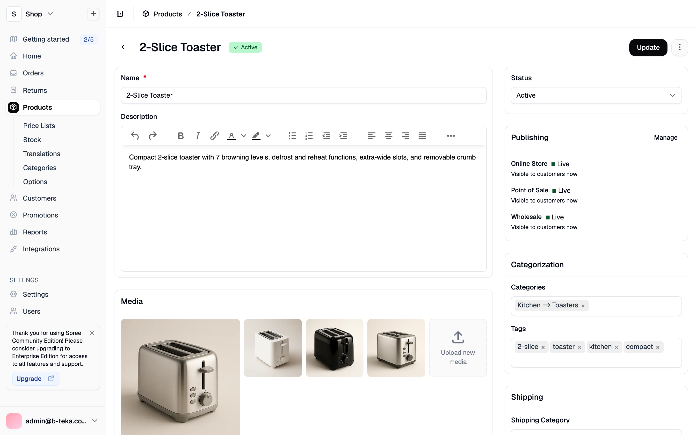

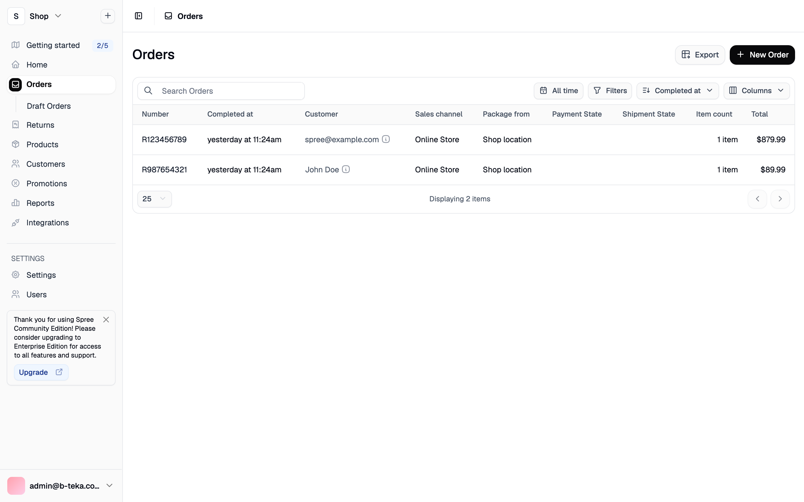

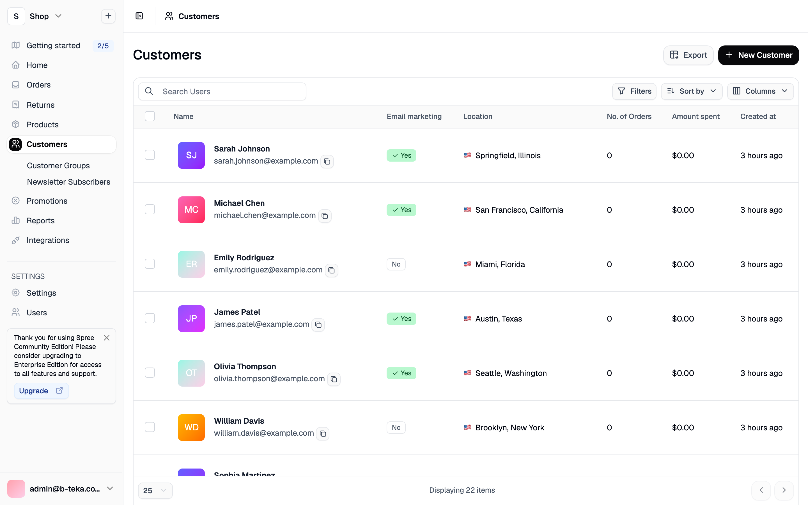

### 2.3 B2B configuration

Three pieces make B2B work. All are configured and running.

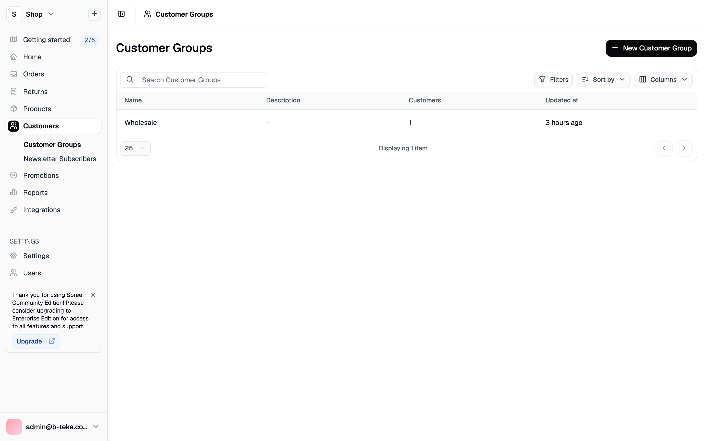

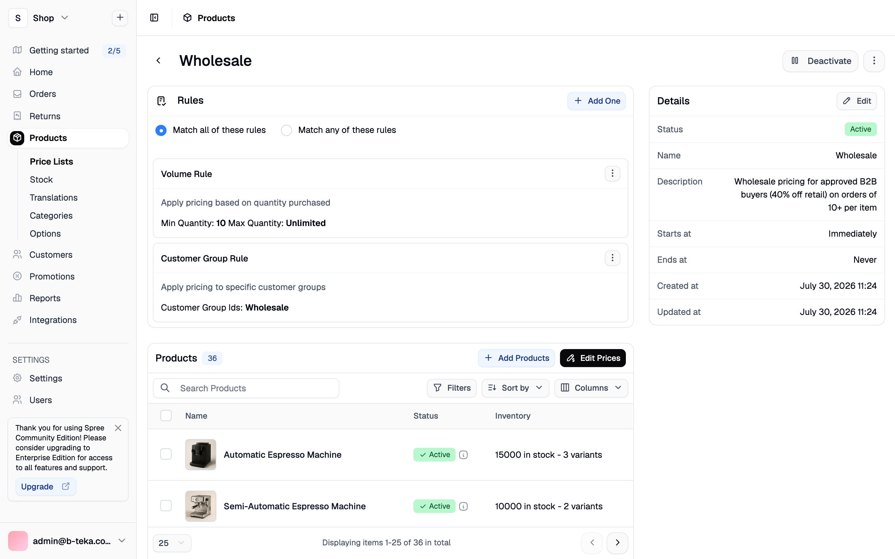


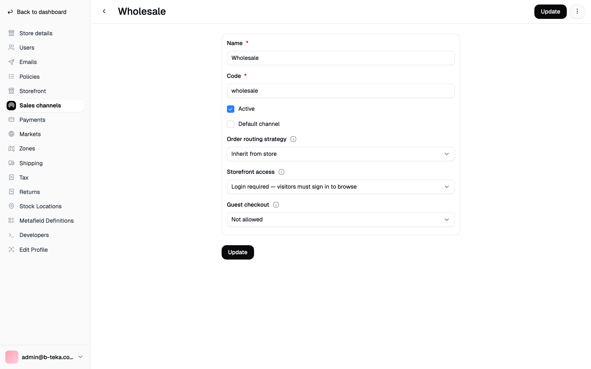

### 2.4 Roles and permissions

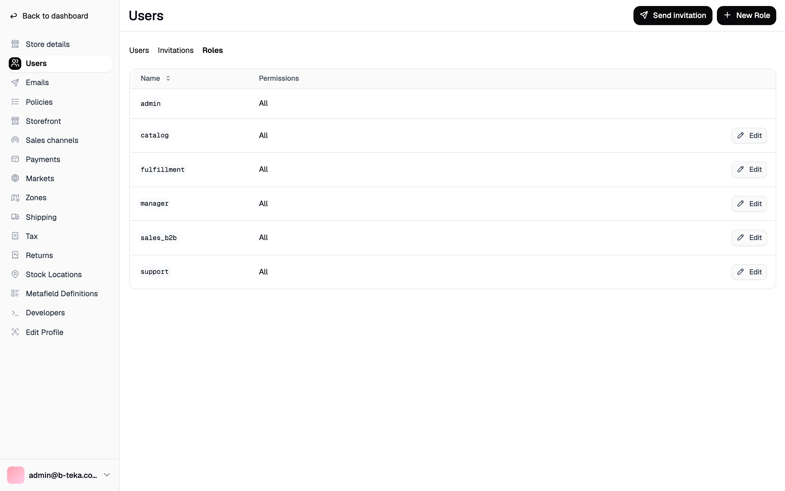

---

## 3. Accounts

Each staff account has its own password, sent separately. They are deliberately not
listed here.

### 3.1 Staff — sign in at `/admin`

This is the **complete** list — there are exactly seven admin accounts on the system.

| Email | Role | Scope |
|---|---|---|
| `admin@b-teka.com` | Administrator | Everything, including permissions and configuration |
| `manager@b-teka.com` | Store manager | Orders, products, stock, promotions, price lists, view customers |
| `catalog@b-teka.com` | Catalogue staff | Products, stock and price lists only |
| `fulfillment@b-teka.com` | Fulfilment | Orders, customers, stock, view products |
| `sales_b2b@b-teka.com` | B2B sales | Orders, products, stock, **manage customers and customer groups** |
| `support@b-teka.com` | Customer support | **Read only** |
| `spree@example.com` | Administrator | Created by Spree's sample data — see the warning below |

> **`spree@example.com` — delete this account.** It is created automatically by Spree's
> sample-data loader and carries the **full administrator role**. It shipped with
> Spree's publicly documented default password (`spree123`); that password has been
> rotated to the handover password above, so the default no longer works. It is listed
> here only so nothing is hidden. It serves no purpose once the sample catalogue is
> removed — **delete it as part of go-live**:
>
> ```
> Spree::AdminUser.find_by(email: 'spree@example.com')&.destroy
> ```
>
> Whenever `spree:load_sample_data` is run again, this account comes back with the
> default password. Never run that task against a production store.

Permissions are verified automatically — `node script/audit_roles.mjs` reports **6/6
roles matching their intended access**. Confirmed by that check: `catalog` cannot reach
Orders or Customers, `support` cannot reach Stock or Configuration, and only `admin`
reaches Roles and Store settings.

> **Two things to know about Spree permissions:**
>
> 1. Creating a Role in the admin grants **nothing** on its own. A role only means
>    something once permission sets are assigned to it in
>    `config/initializers/spree.rb` — that is code, not a UI setting. A role with no
>    permission sets can sign in and see an empty admin.
> 2. The **Price Lists screen is gated by `ProductDisplay`, not `ProductManagement`**.
>    A read-only role such as `support` can therefore **see wholesale pricing**. That
>    is Spree's behaviour, not a configuration choice here. If it is commercially
>    unacceptable, remove `ProductDisplay` from the `support` role.

### 3.2 Customers — sign in on the storefront

| Email | Type | Password |
|---|---|---|
| `wholesale@example.com` | **B2B customer**, member of the `Wholesale` group | sent separately |
| `retail@b-teka.com` | Retail customer | sent separately |

To see B2B pricing in action, sign in as the wholesale customer and add **10 or more**
units of a single item — below 10 the retail price applies.

> **The demo addresses are not real mailboxes.** `admin@b-teka.com`,
> `retail@b-teka.com` and the rest do not exist, so "forgot password" on them sends
> mail that bounces (`550 User does not exist`). Email itself works — to see it, use a
> real address. Change one of these accounts to your own address, or create a customer
> with it, before testing password reset or order confirmations.

There are **22 customer records in total**. The other 20 (`sarah.johnson@example.com`,
`michael.chen@example.com`, and similar) come from Spree's sample data. They each have
a password set, but it is randomly generated and not recorded anywhere, so nobody can
sign in as them. They are demo records and **will be removed together with the sample
catalogue** before go-live.

### 3.3 Other credentials

| | |
|---|---|
| `/jobs` dashboard | HTTP Basic — user `jobs`, password in the server `.env` |
| API key — online channel (B2C) | sent separately |
| API key — wholesale channel (B2B) | sent separately |

API keys are sent in the **`X-Spree-Api-Key`** header. `Authorization: Bearer` returns
401 — a common first mistake.

---

## 4. URLs

| Purpose | URL |
|---|---|
| **Customer storefront** | https://shop.b-teka.com |
| **Admin** | https://spree.b-teka.com/admin |
| React dashboard (newer admin) | https://spree.b-teka.com/dashboard |
| Store API | https://spree.b-teka.com/api/v3/store/ |
| Admin API | https://spree.b-teka.com/api/v3/admin/ |
| Background jobs | https://spree.b-teka.com/jobs |
| Health check | https://spree.b-teka.com/up |

Both domains serve HTTPS with automatically renewing certificates.

---

## 5. Platform

| Component | Version |
|---|---|
| Spree Commerce | **5.6.1 Community Edition** |
| Rails | 8.1.3 |
| Ruby | 4.0.1 |
| PostgreSQL | 18.4 |
| Storefront | spree/storefront — Next.js 16, React 19, Tailwind 4 (MIT) |
| Node (storefront) | 22 |
| Operating system | Ubuntu 24.04 LTS |
| Container runtime | Docker + Docker Compose |
| Web server | nginx reverse proxy, TLS via Let's Encrypt |
| Source | github.com/luanpm88/spree |

### Architecture

```
  Customers ──►  shop.b-teka.com   ──►  Storefront (Next.js)  ──┐
                                                                 │  Store API
  Staff     ──►  spree.b-teka.com  ──►  Spree (Rails + Puma)  ◄──┘
                                             │
                                             └──►  PostgreSQL
```

Two points worth knowing:

- **No Redis.** Background jobs (Solid Queue), cache (Solid Cache) and websockets
  (Solid Cable) all run inside PostgreSQL. Jobs run in the same Puma process, so there
  is no separate worker to operate.
- **The storefront's API URL is baked in at build time.** Next.js prerenders pages
  against the Spree API during the image build, so pointing the storefront at a
  different backend requires a **rebuild**, not an environment change.

### Release process

There is no CI. A release is a script you run and watch.

```
script/deploy ship backend
   └─► builds the linux/amd64 image on the operator's machine
          └─► streams it over SSH straight into the server's Docker
                 └─► backs up the database, releases, health-checks
```

The server never builds. Building Spree needs roughly 2 GB of RAM and several minutes
of CPU, which this server does not have to spare.

The order matters: the database is dumped **before** the new container starts, because
migrations run from the image entrypoint. The script then waits for the health check
and aborts the release if the application does not come up.

---

## 6. What is in place

| | |
|---|---|
| Full admin interface | ✅ |
| Customer storefront (Next.js) | ✅ |
| Store API and Admin API | ✅ |
| Six job-function roles, automatically audited | ✅ |
| **B2B** — dedicated channel requiring sign-in | ✅ |
| **B2B** — customer groups | ✅ |
| **B2B** — price lists by group and by quantity | ✅ |
| Multi-channel (online / wholesale / POS) | ✅ |
| Multi-market (7 regions) | ✅ |
| HTTPS on both domains, auto-renewing | ✅ |
| Scripted, health-checked deployment | ✅ |
| Database backup on every deploy | ✅ |
| Transactional email (SendGrid, DKIM-signed) | ✅ |

### Current data is **sample data**

36 products / 121 variants / 22 customers / 2 orders / 24 categories / 12 shipping
methods. This is Spree's demo catalogue, not real inventory. It must be removed before
trading.

### Transactional email

Configured and verified end to end:

| | |
|---|---|
| Provider | SendGrid (SMTP relay, port 587) |
| Sender | `soft.support@hoangkhang.com.vn` |
| Authentication | domain-authenticated in SendGrid — DKIM and SPF signed |

Verified by sending through Spree's own mailer stack and confirming delivery in the
provider's activity log, not just a successful SMTP handshake.

> `b-teka.com` is **not** authenticated with the mail provider, so mail cannot be sent
> as `…@b-teka.com` — it would be rejected or treated as spam. To send from a b-teka
> address, authenticate the domain with the provider (add its DKIM/SPF DNS records)
> first.

### B2B configuration in place

| Item | Value |
|---|---|
| B2B channel | `wholesale` — *Storefront access: Login required*, *Guest checkout: Not allowed* |
| Customer group | `Wholesale` |
| Price list | `Wholesale` — Active, 255 prices, **matches ALL** of: |
| → rule 1 | Volume Rule — quantity **10 or more** |
| → rule 2 | Customer Group Rule — member of **Wholesale** |

Because the match policy is ALL, a customer must be **both** in the Wholesale group
**and** buying 10+ units to receive wholesale pricing.

---

## 7. What is not in place

Ordered by how much it blocks real trading.

| # | Item | Severity | Notes |
|---|---|---|---|
| 1 | Transactional email | ✅ **working** | Sending through SendGrid from an authenticated domain (DKIM/SPF signed). Verified end to end — see §6. |
| 2 | **No Vietnamese payment gateway** | 🔴 **blocker** | Only Stripe, PayPal and Adyen are available. VNPay / MoMo / bank transfer have no published gem and must be implemented as a custom `PaymentMethod`. |
| 3 | **Currency is USD** | 🔴 **blocker** | Switching to VND means re-entering all prices. |
| 4 | Sample data still loaded | 🔴 | Remove and import the real catalogue. This also removes the 20 demo customer records. |
| 5 | Handover passwords still active | 🔴 | Rotate all seven admin accounts and both demo customers. |
| 5b | **Delete `spree@example.com`** | 🔴 | Full-administrator account created by the sample-data loader, originally carrying Spree's public default password. Rotated, but it should not exist on a real store. See §3.1. |
| 6 | **Server memory** | 🟠 | See §8. |
| 7 | B2B order approval workflow | 🟠 | The `OrderApproval` model and table exist, but nothing creates or processes approvals — the workflow must be built. |
| 8 | Multiple buyers under one company account | 🟠 | The `Invitation` model exists; the flow must be built. |
| 9 | Credit terms / pay-on-account (NET 30) | 🟡 | Not available; custom work. |
| 10 | Quotations | 🟡 | Not available; custom work. |
| 11 | Off-server backups | 🟡 | Backups are taken on deploy but stored on the same machine. |
| 12 | Dedicated `JWT_SECRET_KEY` | 🟡 | Currently falls back to `secret_key_base`. |
| 13 | Storefront still uses the stock Spree theme | 🟡 | Needs brand design. |
| 14 | Vietnamese translations unverified | 🟡 | `spree_i18n` is installed; coverage not checked. |

---

## 8. Infrastructure warning

**Spree currently runs on a shared server that also hosts roughly 28 other websites**
(MySQL + PHP-FPM), with **1.9 GB RAM in total**.

Spree's own documentation states one Spree process needs approximately **1 GB**.
Measured on this machine: about **480 MB idle**, peaking near **890 MB during image
processing**, plus the storefront and PostgreSQL.

During deployment the kernel **OOM-killed a 128 KB maintenance process**, which
confirms the machine runs close to its limit.

Mitigations applied:

- swap increased to 6 GB, `vm.swappiness` lowered to 10
- per-container memory limits (Spree 1200 MB, PostgreSQL 512 MB, storefront 420 MB)
- PostgreSQL tuned down (`shared_buffers=128MB`)
- **`mysqld` given `oom_score_adj=-800`**, so if memory runs out the kernel terminates
  the Spree or storefront container **first** and leaves the 28 other sites running

These held during deployment: the container memory limit stopped Spree twice during
image processing without affecting MySQL, nginx or any other site.

**Recommendation: move Spree to its own server with at least 2 GB RAM, or increase
this machine to 4 GB.** The present setup is adequate for demo and UAT but should not
carry sustained production traffic.

---

## 9. Day-to-day operations

All commands run from the source directory on the server.

`script/deploy` is the single entry point, run from the source directory on the
operator's machine. `script/deploy help` lists every subcommand.

```bash
# release
script/deploy ship backend     # build locally, stream over SSH, back up, release
script/deploy status           # what is running, and is it healthy
script/deploy logs             # tail the application log
script/deploy verify           # check the public URLs answer

# Rails console and database, without hunting for the compose file
script/deploy console
script/deploy psql

# rotate the demo accounts
docker compose -f docker-compose.prod.yml exec web bin/rails demo:seed_users PASSWORD='...'

# prove email actually arrives (check the provider's log, not just the handshake)
docker compose -f docker-compose.prod.yml exec web bin/rails runner script/smoke_mail.rb you@example.com
```

**Rollback:** `script/deploy releases` lists what is available, `script/deploy rollback`
returns to the previous image.

Rolling the image back does **not** roll migrations back. If a release included a
breaking migration, restore from the pre-deploy dump instead — one is taken
automatically before every release.

---

## 10. Gotchas

Things that will cost time if not known up front.

1. **The storefront bakes its API URL at build time.** Repointing it at another backend
   is a rebuild, not an environment variable change.
2. **Store API authentication uses `X-Spree-Api-Key`.** `Authorization: Bearer` returns
   401.
3. **API keys are scoped to a sales channel.** The wholesale key returns
   `401 authentication_required` for anonymous requests — that is the B2B gate working
   as designed, not a fault.
4. **`RAILS_ASSUME_SSL=true` with `RAILS_FORCE_SSL=false`.** nginx already redirects to
   HTTPS; setting `FORCE_SSL=true` produces a redirect loop.
5. **Migrations run from the image entrypoint** when the container starts, so any
   backup must be taken *before* that. `script/deploy` does this in the right order.
6. **Use `restart: always`, not `restart: unless-stopped`.** On a host reboot the
   shutdown sequence stops the container, Docker records that as a deliberate stop, and
   `unless-stopped` then refuses to bring it back when the daemon restarts. This cost
   five days of downtime after a kernel upgrade, with nothing to signal it was down.
6. **Containers bind to `127.0.0.1` only.** Do not change to `0.0.0.0` — Docker inserts
   its NAT rules ahead of the host firewall, which would expose the app directly.
7. **Never edit gem source.** Order of preference for changing behaviour: events and
   subscribers → swap a service via `Spree.dependencies` → an extension gem →
   decorators last. Before adding a database column, check whether a **Metafield**
   solves it.
8. **AWS blocks outbound port 25**, so SMTP must use port 587 or 465.
9. **Price and stock live on the variant, not the product.** Products are grouping
   containers; every product has at least one (possibly hidden) variant.
